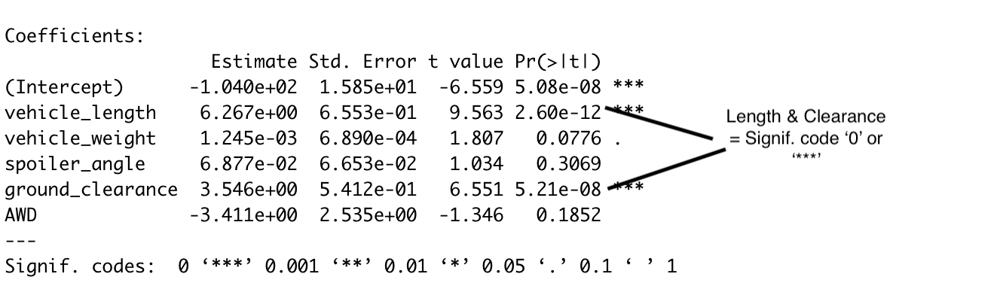
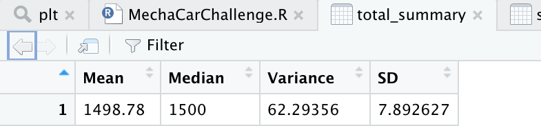
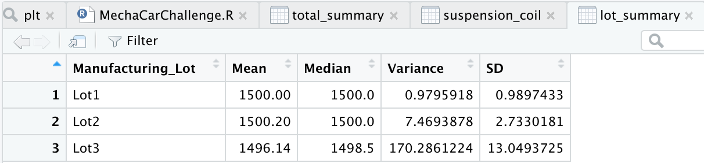

# MechaCar_Statistical_Analysis
Module 15 Challenge

## Linear Regression to Predict MPG
- **Which variables/coefficients provided a non-random amount of variance to the mpg values in the dataset?** Vehicle length (value = 0.0000105 or 2.60e-12) and ground clearance (value = 0.00000184 or 5.21e-08) provide non-random amounts of variance to the mpg values. This is because they show having a significant impact on the mpg with their significance almost equal to zero.

- **Is the slope of the linear model considered to be zero? Why or why not?** The slope of this linear model is not considered zero. If we look at our p-value, which is 5.35e-11, it is much smaller than the assumed significance level of 0.05% and disproves the null hypothesis.
- **Does this linear model predict mpg of MechaCar prototypes effectively? Why or why not?** When looking at the multiple R-squared value of 0.7149, we can see that this value falls between the ideal range for r-sqaured values of 0 and 1. This means that approximately 71% of the variability of our dependent variable can be explained using this multiple linear regression model.

## Summary Statistics on Suspension Coils
- **The design specifications for the MechaCar suspension coils dictate that the variance of the suspension coils must not exceed 100 pounds per square inch. Does the current manufacturing data meet this design specification for all manufacturing lots in total and each lot individually? Why or why not?** 

As pictured above, we can see that the variance is 62.29356, which falls within the design specifications of not exceeding 100 pounds per square inch. Therefore, when viewing the total summary, the manufacturing data meets this design specification. While looking at the lot summaries, pcitured below, lots 1 (var=0.97959) and 2 (var=7.46939) fall within the specifications, while lot 3 exceeds those specifications. Therefore, only 2 out of the three lots meet these specifications.

